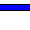
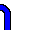
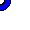
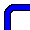
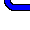
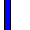
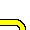
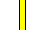
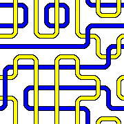

# 2-dimensional toroidal grid example

In this example we will see how to use the wfc4j library to generate a 2D toroidal pattern with programmatically constructed tiles. Each tile will be the combination of two components.

- First component:

| LR__ | LB__ | LT__ | RB__ | RT__ | BT__ |
|:----:|:----:|:----:|:----:|:----:|:----:|
|||||||

- Second component:

| __LR | __LB | __LT | __RB | __RT | __BT |
|:----:|:----:|:----:|:----:|:----:|:----:|
|||||||

And therefore the adjacency of the tiles will be based on how the two components of each tile fit together with the components of the adjacent tiles. In our example this is computed like this:

```java
import eu.irzinfante.wfc4j.enums.Side2D;
import eu.irzinfante.wfc4j.exceptions.DimensionException;
import eu.irzinfante.wfc4j.exceptions.TileException;
import eu.irzinfante.wfc4j.model.Tile;
import eu.irzinfante.wfc4j.model.TileMap2D;

final String LR = "LR", LB = "LB", LT = "LT", RB = "RB", RT = "RT",   BT = "BT";
final var components = new String[] {LR, LB, LT, RB, RT, BT};

var tileSet = new HashSet<Tile<String>>();
for(var first : components) {
	for(var second : components) {
		tileSet.add(new Tile<>(first + second));
	}
}

var tileMap = new TileMap2D<>(tileSet);

for(var tile : tileSet) {
	var tileFirstLeft = tile.getValue().substring(0, 2).contains("L");
	var tileSecondLeft = tile.getValue().substring(2, 4).contains("L");
	var leftAdjacents = new HashSet<Tile<String>>();

	var tileFirstRight = tile.getValue().substring(0, 2).contains("R");
	var tileSecondRight = tile.getValue().substring(2, 4).contains("R");
	var rightAdjacents = new HashSet<Tile<String>>();

	var tileFirstBottom = tile.getValue().substring(0, 2).contains("B");
	var tileSecondBottom = tile.getValue().substring(2, 4).contains("B");
	var bottomAdjacents = new HashSet<Tile<String>>();

	var tileFirstTop = tile.getValue().substring(0, 2).contains("T");
	var tileSecondTop = tile.getValue().substring(2, 4).contains("T");
	var topAdjacents = new HashSet<Tile<String>>();

	for(var adjacent : tileSet) {
		var adjacentFirstLeft = adjacent.getValue().substring(0, 2).contains("L");
		var adjacentSecondLeft = adjacent.getValue().substring(2, 4).contains("L");
		if( (tileFirstRight && adjacentFirstLeft && tileSecondRight && adjacentSecondLeft) ||
			(tileFirstRight && adjacentFirstLeft && !tileSecondRight && !adjacentSecondLeft) ||
			(!tileFirstRight && !adjacentFirstLeft && tileSecondRight && adjacentSecondLeft) ||
			(!tileFirstRight && !adjacentFirstLeft && !tileSecondRight && !adjacentSecondLeft)
		) {
			rightAdjacents.add(adjacent);
		}

		var adjacentFirstRight = adjacent.getValue().substring(0, 2).contains("R");
		var adjacentSecondRight = adjacent.getValue().substring(2, 4).contains("R");
		if( (tileFirstLeft && adjacentFirstRight && tileSecondLeft && adjacentSecondRight) ||
			(tileFirstLeft && adjacentFirstRight && !tileSecondLeft && !adjacentSecondRight) ||
			(!tileFirstLeft && !adjacentFirstRight && tileSecondLeft && adjacentSecondRight) ||
			(!tileFirstLeft && !adjacentFirstRight && !tileSecondLeft && !adjacentSecondRight)
		) {
			leftAdjacents.add(adjacent);
		}

		var adjacentFirstTop = adjacent.getValue().substring(0, 2).contains("T");
		var adjacentSecondTop = adjacent.getValue().substring(2, 4).contains("T");
		if( (tileFirstBottom && adjacentFirstTop && tileSecondBottom && adjacentSecondTop) ||
			(tileFirstBottom && adjacentFirstTop && !tileSecondBottom && !adjacentSecondTop) ||
			(!tileFirstBottom && !adjacentFirstTop && tileSecondBottom && adjacentSecondTop) ||
			(!tileFirstBottom && !adjacentFirstTop && !tileSecondBottom && !adjacentSecondTop)
		) {
			bottomAdjacents.add(adjacent);
		}

		var adjacentFirstBottom = adjacent.getValue().substring(0, 2).contains("B");
		var adjacentSecondBottom = adjacent.getValue().substring(2, 4).contains("B");
		if( (tileFirstTop && adjacentFirstBottom && tileSecondTop && adjacentSecondBottom) ||
			(tileFirstTop && adjacentFirstBottom && !tileSecondTop && !adjacentSecondBottom) ||
			(!tileFirstTop && !adjacentFirstBottom && tileSecondTop && adjacentSecondBottom) ||
			(!tileFirstTop && !adjacentFirstBottom && !tileSecondTop && !adjacentSecondBottom)
		) {
			topAdjacents.add(adjacent);
		}
	}

	tileMap.setAdjacents(tile, Side2D.Left, leftAdjacents);
	tileMap.setAdjacents(tile, Side2D.Right, rightAdjacents);
	tileMap.setAdjacents(tile, Side2D.Bottom, bottomAdjacents);
	tileMap.setAdjacents(tile, Side2D.Top, topAdjacents);
}
```

> Please, take your time on understanding the code above.

Now we can instantiate the API class with an 6 by 6 grid:

```java
import eu.irzinfante.wfc4j.api.WaveFunctionCollapseToroidal2D;

int gridSizeX = 6, gridSizeY = 6;
var WFC = new WaveFunctionCollapseToroidal2D<String>(tileMap, gridSizeX, gridSizeY, 103478937644546L);
```

Finally we will perform the excution of the `generate` function:

```java
import eu.irzinfante.wfc4j.util.WFCUtils;

var result = WFC.generate();
System.out.println(WFCUtils.WFC2DToString(result));
```


